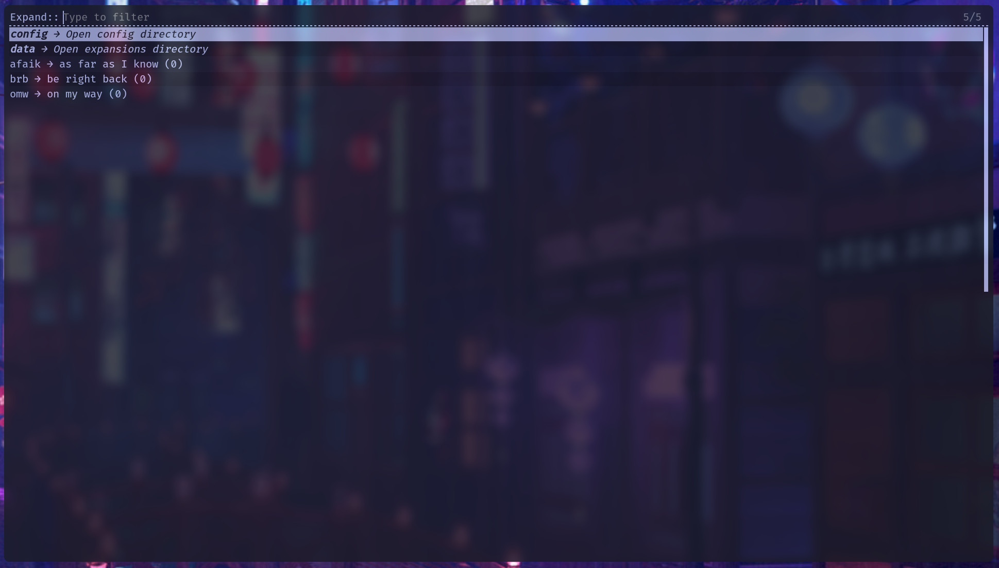

# Tylex

A simple, fast, and powerful text expansion utility for the modern Linux desktop, using your favorite menu launcher (`rofi` or `dmenu`).

Tylex lets you create short abbreviations (e.g., `em`) that expand into longer phrases or snippets of text (e.g., `user@example.com`). It's written in pure shell script, making it lightweight and a perfect fit for any workflow, from minimal tiling window managers to full-featured desktop environments.

**

---
## Features

  * **Flexible Actions**: Press `Enter` to type text instantly, or press `Ctrl+Enter` to copy it to the clipboard.
  * **Fast & Lightweight**: Written in shell script with minimal dependencies.
  * **Launcher-Based**: Uses `rofi` or `dmenu`, so it integrates perfectly with your existing workflow.
  * **Usage-Aware**: Automatically sorts your expansions by how often you use them.
  * **Fuzzy Finding**: Full fuzzy search support when using `rofi`.
  * **XDG Compliant**: Follows standards for storing configuration and data files.
---
## Dependencies

Tylex requires the following programs, which will be installed automatically when using a package manager.

* `bash`
* `jq` (for parsing JSON)
* `rofi` (Recommended launcher)
* `dmenu` (Fallback launcher)
* `xdotool` (for typing on X11)

Tylex is smart and will automatically use whichever launcher it finds. We recommend `rofi` for the best experience.
---
## Usage

Tylex works in two simple steps: adding a new snippet and expanding it.

### 1. Add an Expansion

Use your hotkey for `tylex-add` (e.g., `Super + Shift + Z`). You will be prompted twice:

1.  First, type the short **abbreviation** you want to use (e.g., `em`) and press Enter.
2.  Next, type the full **expansion text** it should become (e.g., `your-email@example.com`) and press Enter.

### 2. Use an Expansion

Use your hotkey for `tylex-expand` (e.g., `Super + Z`).

1.  A list of all your saved expansions will appear in `rofi` or `dmenu`.
2.  Start typing any part of the abbreviation or the expansion to **filter** the list.
3.  Select the entry you want and press Enter. The full text will be typed out for you instantly.
---
## Installation

### Method 1: Via a Package Manager (e.g., AUR)

This is the recommended method for most users.

```sh
yay -S tylex-git
```

### Method 2: Manual Installation from Source

1.  **Install the Tylex Scripts (with `sudo`)**:
```sh
git clone https://github.com/raoeus/tylex.git
cd tylex
sudo make install
```
2.  **Create Your User Configuration (without `sudo`)**:
```sh
make config
```
---
## Post-Installation: Setting a Hotkey

Tylex is most effective when bound to a keyboard shortcut. The process differs between graphical desktop environments and tiling window managers.

A safe and memorable shortcut is `Super + ;` (the Super key is the Windows or Command key).

### Desktop Environments (GNOME, KDE, XFCE)

> **Must use X11. Wayland is incompatible.**

Most desktop environments provide a graphical settings panel to create custom keyboard shortcuts that run a command.

1.  Open your system's **Settings** application.

2.  Navigate to the **Keyboard** or **Shortcuts** section.

3.  Look for an option to add a **Custom Shortcut**.

4.  Create two new shortcuts with the following details:

      * **Shortcut 1: Expand Text**
          * **Name:** `Tylex Expand`
          * **Command:** `tylex-expand`
          * **Shortcut:** `Super + ;`
      * **Shortcut 2: Add Expansion**
          * **Name:** `Tylex Add`
          * **Command:** `tylex-add`
          * **Shortcut:** `Super + Shift + ;`

### Tiling Window Managers

For tiling window managers, you'll need to edit your configuration file directly.

#### i3wm (`~/.config/i3/config`)

```
# Tylex: Expand a snippet
bindsym $mod+semicolon exec tylex-expand

# Tylex: Add a new snippet
bindsym $mod+Shift+semicolon exec tylex-add
```

#### Sway (`~/.config/sway/config`)

The syntax is identical to i3.

```
# Tylex: Expand a snippet
bindsmy $mod+semicolon exec tylex-expand

# Tylex: Add a new snippet
bindsym $mod+Shift+semicolon exec tylex-add
```

#### bspwm (`~/.config/sxhkd/sxhkdrc`)

```
# Tylex: Expand a snippet
super + semicolon
    tylex-expand

# Tylex: Add a new snippet
super + shift + semicolon
    tylex-add
```

#### AwesomeWM (`~/.config/awesome/rc.lua`)

```lua
awful.keyboard.append_global_keybindings({
  -- Tylex: Expand a snippet
  awful.key({ modkey }, ";", function () awful.spawn.with_shell("tylex-expand") end,
            {description = "Expand Tylex snippet", group = "launcher"}),

  -- Tylex: Add a new snippet
  awful.key({ modkey, "Shift" }, ";", function () awful.spawn.with_shell("tylex-add") end,
            {description = "Add Tylex snippet", group = "launcher"})
})
```
